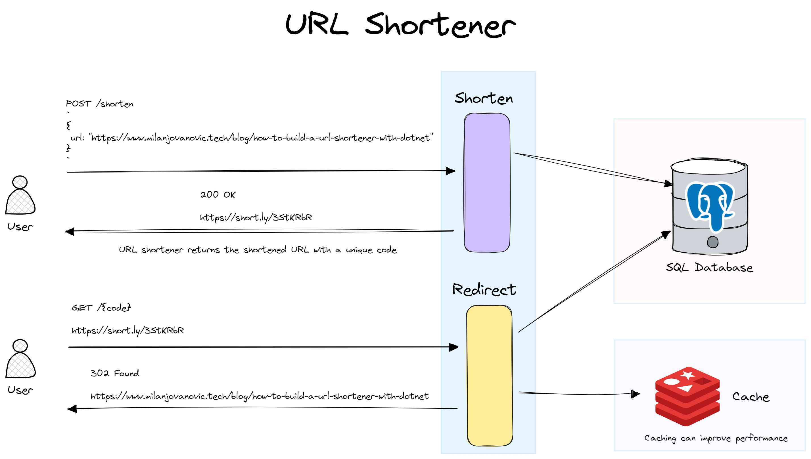

# Practice: Url Shortener

I am going to be practicing building APIs. As part of that, I am going to be tackling creating a URL shortener service. It is going to be based on the scenario outlined here: [Milan Jovanovic's URL Shortener API Design](https://www.milanjovanovic.tech/blog/how-to-build-a-url-shortener-with-dotnet). I am not going to be reading beyond the first few paragraphs, as I want to try and build this on my own.

## Design

We want to expose two endpoints. One to shorten a long URL and the other to redirect users based on a shortened URL. The shortened URLs are stored in a PostgreSQL database in this example. We can introduce a distributed cache like Redis to the system to improve read performance.

 

We first need to ensure a large number of short URLs. We're going to assign a unique code to each long URL, and use it to generate the shortened URL. The unique code length and set of characters determine how many short URLs the system can generate. We will discuss this in more detail when we implement unique code generation.

We're going to use the random code generation strategy. It's straightforward to implement and has an acceptably low rate of collisions. The trade-off we're making is increased latency, but we will also explore other options.

## Implementation

I will be documenting here how I end up implementing this.

### Setup

- Create solution
- Create Aspire AppHost project
- Create Aspire ServiceDefaults project
- Create Api project

### Technologies

- .NET 9
- ASP.NET Core Web API
- FastEndpoints
- Seq
- Entity Framework Core
- PostgreSQL
- Aspire

### EF Core

dotnet ef migrations add InitialDbMigration --context UrlShortenerDbContext --output-dir Data/Migrations/UrlShortener
dotnet ef database update --context UrlShortenerDbContext
